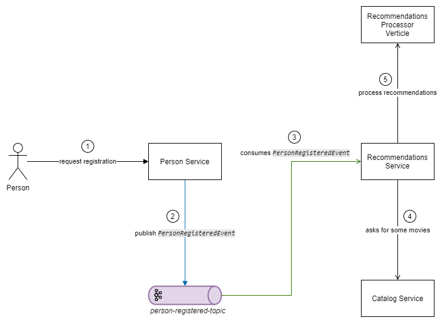
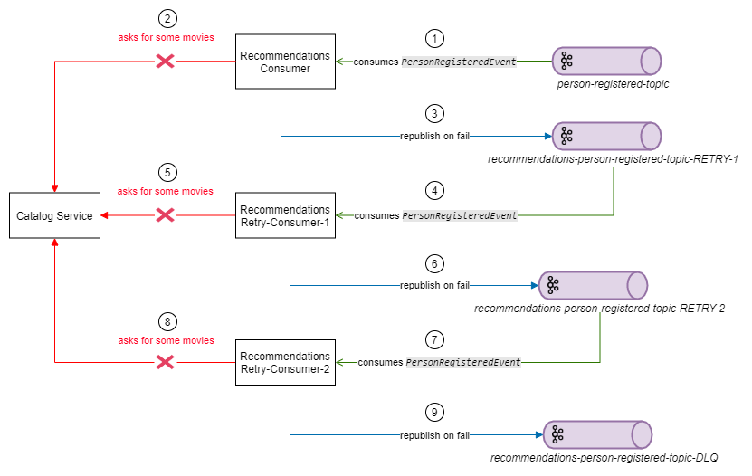

# vertx-retryable-kafka-consumer - Implementação de exemplo

Este projeto apresenta uma implementação de demonstração sobre como poderíamos utilizar mecanismos de _retry_ e _DLQ_ numa arquitetura _event driven_, utilizando-se do _Apache Kafka_, _Vertx_ e _RxJava_.

## Visão geral

Temos um sistema de catálogo de filmes, composto basicamente por três aggregates: ___Person___, ___Catalog___ e ___Recommendations___. Onde _Person_ é responsável pelos usuários do sistema, _Catalog_ pelos filmes disponíveis e _Recommendations_ por gerir a recomendação de filmes ao usuário de acordo com seus critérios diversos. Cada qual com seu próprio serviço instanciado, com um diferencial em _Recommendations_, onde teremos dois serviços compondo o _aggregate_: ___recommendations-service___, o serviço principal onde o ator do nosso caso de uso interage com o sistema, e temos também o ___recommendations-processor-verticle___ que seria uma instância dedicada para processamento de recomendações, ele que aplicará a lógica que definirá qual filme será recomendado ao usuário. Esta divisão foi feita a fim de simular algo mais próximo do mundo real, além de agregar mais conteúdo à obra.

Quando um novo usuário é registrado em ___Person___, um evento comunicando sobre o fato que ocorreu no sistema é publicado (_PersonRegisteredEvent_), e o serviço ___recommendations-service___ reage a esse evento, começando a traçar o perfil do usuário para recomendar filmes



## Sobre a metodologia de _retry_ aplicada

Esta implementação utiliza a estratégia descrita como "Reprocessamento em filas separadas" no [artigo](https://link) em que esse projeto se baseou.

Nessa estratégia, quando uma mensagem falha, assume-se que a mesma foi consumida com sucesso, realizando o _commit_ do _offset_ do _Kafka Consumer_, dessa forma liberando a fila de processamento que irá para a próxima mensagem. A mensagem problemática é republicada em tópicos de _retry_, onde tem-se um tópico específico para cada tentativa de processamento, então as mensagens irão circular de um tópico para o outro até que sejam processadas corretamente ou a condição de parada for atingida e a mesma seja direcionada para _DLQ_.



## O projeto

### Módulos

O projeto está organizado da seguinte forma:

* _``commons``_ - classes utilitárias, conversores de datas, etc.;
* _``jdbc``_ - modulo facilitador para execuções de _queries_ e gerenciamento de transações via _vertx-sql-client_;
* _``vertx-base-server``_ - abstrações que facilitam o uso do _Vertx_ como servidor _http_;
* _``event``_ - abstração de eventos e comandos;
* _``kafka``_ - abstração de _producers_ e _consumers_ juntamente com seu mecanismo de retry;
* _``person-event``_ - dados sobre os eventos e tópicos do domínio de _Person_;
* _``recommendations-event``_ - dados sobre os eventos e tópicos do domínio de _Recommendations_;
* _``recommendations-processor``_ - abstração para processamento de recomendações de filmes;
* _``modules``_ - _multi-module maven project_, agregando todos os artefatos citados até então, em um único projeto, a fim de facilitar a containerização do projeto;
* _``catalog``_ - serviço responsável por gerenciar os filmes do sistema;
* _``person``_ - serviço responsável por gerenciar as pessoas do sistema;
* _``recommendations``_ - serviço responsável por gerenciar as recomendações de filmes;
* _``recommendations-processor-verticle``_ - nó de um cluster _Vertx_ onde um serviço de processamento de recomendações está endereçado;

### Startup

Na raiz do projeto encontra-se o arquivo _``docker-compose.yml``,_ com os serviços que entrarão em execução, juntamente com o _Apache Kafka_. Garanta que seu _environment_ possua o _Docker_ e _Docker Compose_ instalados, e simplemente execute o projeto:
```
docker-compose up
```

Os tópicos criados automaticamente, são:

* _person-registered-topic_
* _recs-per-person-registered-topic-RETRY-1_
* _recs-per-person-registered-topic-RETRY-2_
* _recs-per-person-registered-topic-RETRY-3_
* _recs-per-person-registered-topic-DLQ_
* _recommendations-generated-topic_
* _recs-gen-recommendations-generated-topic-RETRY-1_
* _recs-gen-recommendations-generated-topic-RETRY-2_
* _recs-gen-recommendations-generated-topic-RETRY-3_
* _recs-gen-recommendations-generated-topic-DLQ_

Note que alguns prefixos sao utilizados nos tópicos, cada um representa um _consumer group_ com sua própria finalidade:
* _`recs-per`_ - sigla para _`recommendations-person`_, _consumer group_ do serviço de _`recommendations`_ que irá consumir o evento _`PersonRegisteredEvent`_, iniciando o processamento das recomendações;
* _`recs-gen`_ - sigla para _`recommendations-generated`_, _consumer group_ do serviço de _`recommendations`_ que irá consumir o evento _`RecommendationsGeneratedEvent`_ e realizar a persistencia das recomendações criadas em um banco de dados para leitura (_CQRS_);

### Fluxo de execução

Para inciar o fluxo, basta cadastrar uma nova pessoa, para tal, basta realizar uma requisição _POST_ para _``http://localhost:8080/person/v1``_ com um _JSON_ que segue a seguinte estrutura:

```JSON
{
	"name": "Victor",
	"birth_date": "21/06/1994",
	"email": "victor.hugo.origins@gmail.com",
	"preferences": ["thriller"]
}
```

Como resposta podemos esperar os dados da nova pessoa cadastrada acrescido do seu _GUID_ gerado:

```JSON
{
  "id": "5e3a4d60-1c8e-4857-8a33-d688afde3855",
  "name": "Victor - 8",
  "email": "victor.hugo.origins@gmail.com",
  "birth_date": "21/06/1994",
  "preferences": [
    "thriller"
  ]
}
```

A partir deste ponto, já é possível acompanhar nos _logs_ do sistema o processo obtenção de filmes no serviço de _catalog_, a execução do algoritmo de recomendações em _recommendations-processor-verticle_ e por fim, a publicação do evento _RecommendationsGeneratedEvent_ e seu registro em um banco de dados de leitura, no serviço de _recommendations_.

Caso deseje verificar as recomendaçõe feitas para a pessoa criada, basta realizar uma requisição _GET_ para _``http://localhost:8082/recommendations/v1/person/:person_id``_. Como resposta eh esperada a seguinte estrutura:

```JSON
{
  "id": "32b8031a-ec3e-4657-8ec8-d138be0ae501",
  "person_id": "5e3a4d60-1c8e-4857-8a33-d688afde3855",
  "movies": [
    "9717da82-1fd1-44d3-898c-2524a360a827",
    "55598532-dc16-4ad4-b497-965bc8ad9c02",
    "85034615-d30a-49fa-a8a7-5db81097123a",
    "4c4369df-2f45-4023-8f8d-a339fd0c6869"
  ]
}
```

Por fim, para obter detalhes de algum filme, bata realizar uma requisição _GET_ para _``http://localhost:8083/catalog/v1/details/:movie_id``_. Como resposta é esperada a seguinte estrutura:

```JSON
{
  "id": "9717da82-1fd1-44d3-898c-2524a360a827",
  "title": "Get Out",
  "tags": [
    "horror",
    "mistery",
    "thriller"
  ],
  "release_year": 2017
}
```
### Fluxo de retry

Foi adicionado um ___bug_ proposital__ no _catalog-service_ ao se cadastrar uma pessoa que não possua preferência de filmes. Nessa situação, o serviço irá falhar e portanto, o evento _PersonRegisteredEvent_ não poderá ser processado com sucesso, iniciando-se assim o fluxo de _retry_ e _DLQ_.

A execução do fluxo de _retry_ pode ser acompanhanda a partir da simples leitura dos _logs_, especialmente de _``recommendations``_. Pode-se claro, adicionar seus proprios meios de observação, como um _``kafka-console-consumer``_ por exemplo, para acompanhar por lá o percurso das mensagens.

Exemplo de requisição que ocasiona o _bug_:
```JSON
{
	"name": "Victor",
	"birth_date": "21/06/1994",
	"email": "victor.hugo.origins@gmail.com"
}
```

E pelos _logs_:

```
[RxNewThreadScheduler-1] INFO  ...RetryableKafkaConsumer - Aplicando delay de '0' milisegundo(s) ao evento 'dd759fae-5bd4-4c34-a9e6-bed95d22bbd9', na tentativa '0'
[RxNewThreadScheduler-1] INFO  ...KafkaListenerRetryProxyProcessor - Iniciando processamento do evento dd759fae-5bd4-4c34-a9e6-bed95d22bbd9
[RxNewThreadScheduler-1] ERROR ...KafkaListenerRetryProxyProcessor - Falha no processamento do evento dd759fae-5bd4-4c34-a9e6-bed95d22bbd9, excessao: java.lang.RuntimeException: Falha no catalog aggregate
[RxNewThreadScheduler-1] INFO  ...KafkaListenerRetryProxyProcessor - Republicando evento no topico: recs-per-person-registered-topic-RETRY-1
[RxNewThreadScheduler-1] INFO  ...KafkaListenerRetryProxyProcessor - Evento dd759fae-5bd4-4c34-a9e6-bed95d22bbd9 republicado com sucesso no topico recs-per-person-registered-topic-RETRY-1


[RxNewThreadScheduler-2] INFO  ...RetryableKafkaConsumer - Aplicando delay de '5000' milisegundo(s) ao evento 'dd759fae-5bd4-4c34-a9e6-bed95d22bbd9', na tentativa '1'
[RxNewThreadScheduler-2] INFO  ...KafkaListenerRetryProxyProcessor - Iniciando processamento do evento dd759fae-5bd4-4c34-a9e6-bed95d22bbd9
[RxNewThreadScheduler-2] ERROR ...KafkaListenerRetryProxyProcessor - Falha no processamento do evento dd759fae-5bd4-4c34-a9e6-bed95d22bbd9, excessao: java.lang.RuntimeException: Falha no catalog aggregate
[RxNewThreadScheduler-2] INFO  ...KafkaListenerRetryProxyProcessor - Republicando evento no topico: recs-per-person-registered-topic-RETRY-2
[RxNewThreadScheduler-2] INFO  ...KafkaListenerRetryProxyProcessor - Evento dd759fae-5bd4-4c34-a9e6-bed95d22bbd9 republicado com sucesso no topico recs-per-person-registered-topic-RETRY-2


[RxNewThreadScheduler-3] INFO  ...RetryableKafkaConsumer - Aplicando delay de '10000' milisegundo(s) ao evento 'dd759fae-5bd4-4c34-a9e6-bed95d22bbd9', na tentativa '2'
[RxNewThreadScheduler-3] INFO  ...KafkaListenerRetryProxyProcessor - Iniciando processamento do evento dd759fae-5bd4-4c34-a9e6-bed95d22bbd9
[RxNewThreadScheduler-3] ERROR ...KafkaListenerRetryProxyProcessor - Falha no processamento do evento dd759fae-5bd4-4c34-a9e6-bed95d22bbd9, excessao: java.lang.RuntimeException: Falha no catalog aggregate
[RxNewThreadScheduler-3] INFO  ...KafkaListenerRetryProxyProcessor - Republicando evento no topico: recs-per-person-registered-topic-RETRY-3
[RxNewThreadScheduler-3] INFO  ...KafkaListenerRetryProxyProcessor - Evento dd759fae-5bd4-4c34-a9e6-bed95d22bbd9 republicado com sucesso no topico recs-per-person-registered-topic-RETRY-3


[RxNewThreadScheduler-4] INFO  ...RetryableKafkaConsumer - Aplicando delay de '15000' milisegundo(s) ao evento 'dd759fae-5bd4-4c34-a9e6-bed95d22bbd9', na tentativa '3'
[RxNewThreadScheduler-4] INFO  ...KafkaListenerRetryProxyProcessor - Iniciando processamento do evento dd759fae-5bd4-4c34-a9e6-bed95d22bbd9
[RxNewThreadScheduler-4] ERROR ...KafkaListenerRetryProxyProcessor - Falha no processamento do evento dd759fae-5bd4-4c34-a9e6-bed95d22bbd9, excessao: java.lang.RuntimeException: Falha no catalog aggregate
[RxNewThreadScheduler-4] WARN  ...KafkaListenerRetryProxyProcessor - Evento alcancou o maximo de tentativas de processamento (3), enviando para DLQ...
[RxNewThreadScheduler-4] INFO  ...KafkaListenerRetryProxyProcessor - Republicando evento no topico: recs-per-person-registered-topic-DLQ
[RxNewThreadScheduler-4] INFO  ...KafkaListenerRetryProxyProcessor - Evento dd759fae-5bd4-4c34-a9e6-bed95d22bbd9 republicado com sucesso no topico recs-per-person-registered-topic-DLQ
```